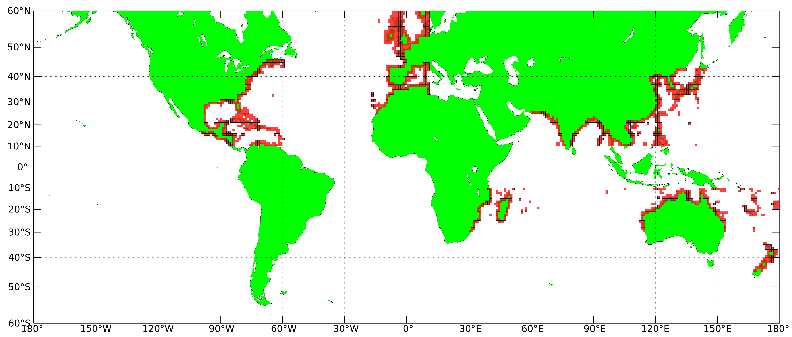

# Latest 6-hourly Forecasts

<!---
## Hydrodynamic: Maximum Storm Tide (Surge + Astronomical Tide) Anomaly

Anomaly from Highest Astronomical Tide (HAT); estimated by the maximum water level from a 1-year (2018) tide-only simulation
-->

## Hydrodynamic: Maximum Surge (metereolorogical driven component above tides)

NOTE: For the automatic 6-hourly forecasts currently just simulating on the default global mesh without high-resolution insets as described below. See archived events for examples of using high-resolution insets in the global mesh.

Click to see closeup of maximum surge and maximum winds/minimum pressure in individual regions

[WA](MaxCombined_WA2km.png) ・ [NA](MaxCombined_NA2km.png) ・ [WE](MaxCombined_WE2km.png) ・ [EA](MaxCombined_EA2km.png) ・ [SA](MaxCombined_SA2km.png) ・ [WP](MaxCombined_WP2km.png) ・ [OC](MaxCombined_OC2km.png)

<map name="mapname">
    <area shape="rect" coords="150,100,200,150" href="MaxCombined_WA2km.png" alt="Western Alaska">
    <area shape="rect" coords="250,170,350,270" href="MaxCombined_NA2km.png" alt="Western North Atlantic">
    <area shape="rect" coords="475,125,525,200" href="MaxCombined_WE2km.png" alt="Western Europe">
    <area shape="rect" coords="575,325,650,400" href="MaxCombined_EA2km.png" alt="East Africa">
    <area shape="rect" coords="650,200,750,275" href="MaxCombined_SA2km.png" alt="South Asia">
    <area shape="rect" coords="750,175,875,275" href="MaxCombined_WP2km.png" alt="West Pacific">
    <area shape="rect" coords="750,325,950,450" href="MaxCombined_OC2km.png" alt="Oceania">
</map>


## Meteorologic: Maximum 10-m Winds and Minimum Sea Surface Pressure


# Archived Events

- [Tropical Cyclone Fani](Archives/Fani/Fani.md)
- [Tropical Cyclone Idai](Archives/Idai/Idai.md)

## How are the Forecasts Obtained?

Forecasts are 2D barotropic ocean circulation and inundation simulations on unstructured triangular meshes subject to meteorological and astronomical forcings, which drive surge and tide respectively. The simulations are conducted using the [ADCIRC](http://adcirc.org/) model. 

The meshes have been automatically generated using the [OceanMesh2D](https://github.com/CHLNDDEV/OceanMesh2D) Matlab meshing toolbox. A single seamless unstructured mesh is used for each forecast. The default mesh which covers the entire Earth has a variable coastal resolution ranging between 2 km and 10 km depending on shoreline complexity. 

Moreover, when a storm is predicted to make landfall a higher resolution (~90 m) inset around the forecasted landfalling region is automatically merged into the global mesh to provide accurate forecasts of extreme water levels and flooding in the landfall region. In this way we can minimize the computational resources in order to provide timely forecasts without sacrificing accuracy where coastal flooding occurs.

Nearly 1400 high-resolution (~90 m) 1 deg x 1 deg inset meshes (indicated by the red boxes in the image below) have been generated in regions where storms and flooding tend to occur. These are automatically merged into the global mesh as necessary. 


### Inputs and Sources
- Meteorology: [FV3-GFS](https://www.emc.ncep.noaa.gov/users/Alicia.Bentley/fv3gfs/) model 10-m wind velocities (U10 and V10) and atmospheric pressure reduced to mean sea level (PRMSL). [Link for latest 10-day - archive of forecasts](https://nomads.ncep.noaa.gov/pub/data/nccf/com/gfs/prod/)
- Topography/Bathymetry: Default for the Earth: [SRTM15+V2.0](https://topex.ucsd.edu/WWW_html/srtm15_plus.html) (~450 m); for high-resolution insets topography is replaced with [SRTM3](https://dds.cr.usgs.gov/srtm/version2_1/SRTM3/) (~90 m) data.
- Shoreline Geometry: Default for the Earth: [GSSHG](http://www.soest.hawaii.edu/wessel/gshhg/); for high-resolution insets shoreline is replaced with the [SWBD](https://dds.cr.usgs.gov/srtm/version2_1/SWBD/) (~30-90 m accuracy) SRTM-based dataset.

<!---

https://wpringle.github.io/Advanced-Global-Coastal-Flood-Forecasting-System/
## Welcome to GitHub Pages

You can use the [editor on GitHub](https://github.com/WPringle/Advanced-Global-Coastal-Flood-Forecasting-System/edit/master/README.md) to maintain and preview the content for your website in Markdown files.

Whenever you commit to this repository, GitHub Pages will run [Jekyll](https://jekyllrb.com/) to rebuild the pages in your site, from the content in your Markdown files.

### Markdown

Markdown is a lightweight and easy-to-use syntax for styling your writing. It includes conventions for

```markdown
Syntax highlighted code block

# Header 1
## Header 2
### Header 3

- Bulleted
- List

1. Numbered
2. List

**Bold** and _Italic_ and `Code` text

[Link](url) and  
```

For more details see [GitHub Flavored Markdown](https://guides.github.com/features/mastering-markdown/).

### Jekyll Themes

Your Pages site will use the layout and styles from the Jekyll theme you have selected in your [repository settings](https://github.com/WPringle/Advanced-Global-Coastal-Flood-Forecasting-System/settings). The name of this theme is saved in the Jekyll `_config.yml` configuration file.

### Support or Contact

Having trouble with Pages? Check out our [documentation](https://help.github.com/categories/github-pages-basics/) or [contact support](https://github.com/contact) and we’ll help you sort it out.
-->
